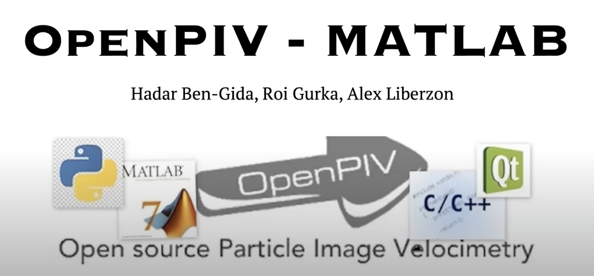

# OpenPIV

## OpenPIV - what is it for? 

OpenPIV is an initiative of scientists to develop a software, algorithms and methods for the state-of-the-art experimental tool of Particle Image Velocimetry (PIV) which are free, open source, and easy to operate.
OpenPIV is the successor of the well known URAPIV software - it is faster, more friendly and much more flexible.
OpenPIV is provided using Matlab, Python or 32bit Windows executable (based on C++ and Qt source).

## Webinar, July 2020

###  How to cite this work

Please cite our paper:

Ben-Gida, H., Gurka, R. and Liberzon, A. (2020) OpenPIV-Matlab - An open-source software for particle image velocimetry; test case: birds' aerodynamics, SoftwareX, 12, p. 100585. doi: https://doi.org/10.1016/j.softx.2020.100585.

and the code itself:

Liberzon, Alex; Gurka, Roi; Ben-Gida, Hadar (2020): OpenPIV - Matlab. figshare. Software. https://doi.org/10.6084/m9.figshare.12330536

### How to download the software
Please note that there are two versions of the GUI: 
1. older Matlab version, before 2014b: https://github.com/OpenPIV/openpiv-matlab/releases/tag/v1.1
2. Newer Matlab versions, use https://github.com/OpenPIV/openpiv-matlab/archive/master.zip or clone this repository

### How to contribute ?

1. Open Github account  
2. Visit our Git repositories through https://github.com/OpenPIV  
3. Fork your favorite repository  
4. Fix, commit, push to your repository and send us a pull request.   
5. register on openpiv-develop mailing list through https://groups.google.com/forum/#!forum/openpiv-users 

###  Getting started  tutorials  
1. Matlab - see the screencast http://youtu.be/yg-LjAt-v3Q
2. Read the [Tutorial](https://github.com/OpenPIV/openpiv-matlab/raw/master/docs/Tutorial_OpenPIV/Tutorial_OpenPIV.pdf)  by <a href="mailto:Sergio.Bengoechea.Lozano@tnt.TU-Berlin.DE"> Sergio Bengoechea Lozano, TU Berlin </a>
  
3. Python - http://www.openpiv.net/openpiv-python/  
4. C++ - not ready yet  
5. Spatial and Temporal Analysis Toolbox http://www.openpiv.net/openpiv-spatial-analysis-toolbox/  
6. Pressure from PIV http://www.openpiv.net/openpiv-pressure  

### Support and documentation  
How to get support? Where to ask questions? Use one of the following:  
1. Google group https://groups.google.com/forum/#!forum/openpiv-users   
2. e-mail to openpiv2008@gmail.com  
3. Comment using Github page  

### Frequently asked questions  
1. [About OpenPIV](https://github.com/OpenPIV/openpiv.github.com/wiki/Frequently-Asked-Questions-about-OpenPIV)
2. [About PIV parameters](https://github.com/OpenPIV/openpiv.github.com/wiki/Frequently-Asked-Questions-about-PIV-parameters)
